# fairy-notation

A notation system for the movements of fairy chess pieces. Applies an
amalgamation of regex-like syntax with algebraic underlying concepts in the
mathematical sense, not in the chess sense.

Moves are written down as items, which can then have modifiers applied to them
that change their behaviour or their position.

Each item represents a "moveset", a set of possible moves.

Each move is a list of "deltas", which represent a x,y (and optionally z)
displacement.

## Lo, the Indivisible Atom

The most basic moveset is the "atom", written as `[x,y]`.

This simply creates a moveset containing one move, x digits along the
horizontal axis, and y digits along the vertical. For example, a move that goes
forward by 2 and to the right by 1 would be written `[1,2]`.

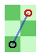

## Addition

Movesets can be "added" using `A,B`.

In the case of addition, all possible moves from both movesets become possible
independently. e.g. `[1,2],[2,1]` becomes a piece capable of doing `[1,2]`
**OR** `[2,1]`.


+
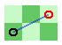
\=
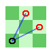

## Multiplication

Movesets can be "multiplied" using `A.B`.

In the case of multiplication, all possible moves from both movesets become
possible, *in sequence*. 

For example, `[1,2].[2,1]` denotes a piece capable of a `[3,3]` move by jumping
to `[1,2]` then to `[2,1]`. As in normal chess, if the `[1,2]` position is
blocked, it would therefore not be possible to proceed to `[2,1],` so the
`[3,3]` jump would become illegal.


*

\=
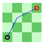

### Multiplication tries all combinations

An important thing to remember about multiplication is it tries all
combinations of moves in each moveset. So, if you have two movesets
`[2,0],[0,2]` (`[2,0]` OR `[2,0]`) and `[1,2],[-1,-2]` (`[1,2]` OR `[-1,-2]`),
their multiplication would be broken down as follows:

```
([2,0],[0,2]).([1,2],[-1,-2])
([2,0].[1,2]) , ([0,2].[1,2]) , ([2,0].[-1,-2]) , ([0,2].[-1,-2])
```

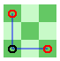
*
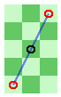
\=


## Moveset Modifiers

Each moveset can be modified by appending modifiers, some of which are listed as follows:

### Mirror, mirror, on the wall...

### `|`

  Reflects a moveset **across** the y-axis (along the x-axis)  
  e.g. `[1,2]|` would mean a piece that can move `[1,2]` or `[-1,2]`

   => 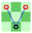

### `-`

  Reflects a moveset **across** the x-axis (along the y-axis)  
  e.g. `[1,2]-` would mean a piece that can move `[1,2]` or `[1,-2]`

   => 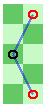

### `+`

  Does both x and y mirrors  
  e.g. `[1,2]+` becomes `[1,2]` or `[1,-2]` or `[-1,2]` or `[-1,-2]`

   => 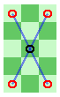

### `/` 

  Swaps the x and y axes  
  e.g. `[1,2]/` becomes `[1,2]` or `[2,1]`

   => 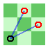

### `*`

  Combines x mirror, y mirror, and swap  
  e.g. `[1,2]*` becomes `[1,2]` or `[1,-2]` or `[-1,2]` or `[-1,-2]` or `[2,1]` or `[2,-1]` or `[-2,1]` or `[-2,-1]`

   => 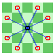

### Containing multitudes...

In order to multiply a moveset with itself, use the range **multiplication**
modifier, written as `{a..b}` or `{c}`.

The ranges can be combined with `,` so one can write
```
{2..3,5,7..9}
```
which would be equivalent to
```
{2,3,5,7,8,9}
```

This multiplies each move in a moveset by itself by the number of times for
each value in the range, and then sums those multiplied movesets.

#### Examples

`[1,2]{1} = [1,2]`


=> {1} =>
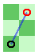

#### `[1,2]{2}`

`[1,2]{2} = [1,2].[1,2]`


=> {2} =>
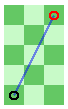

#### `[1,2]{3}`

`[1,2]{3} = [1,2].[1,2].[1,2]`


=> {3} =>
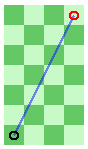

#### `[1,2]{1..3}`


=> {1..3} =>
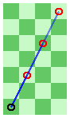

#### `[1,2]{2,3}`


=> {2,3} =>
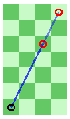

#### `([1,2],[2,1]){2}`

`([1,2],[2,1]){2} = ([1,2].[1,2]),([2,1].[2,1])`


=> {2} =>


#### `([1,2],[2,1]){1..3}`

`([1,2],[2,1]){1..3} = ([1,2]),([1,2].[1,2]),([1,2].[1,2].[1,2]),([2,1]),([2,1].[2,1]),([2,1].[2,1].[2,1])`


=> {1..3} =>


#### Omitting bounds

The bounds on a `..` can be omitted, in which case they'll default to 1 for the
left and infinity for the right.

```
{..4} = {1..4} = {1,2,3,4}
{2..} = {2,3,4,5,6,7...}
{..}  = {1,2,3,4,5,6,7...}
```

#### Useful examples

This is useful for expressing pieces that make multiple of the same small step
as long as possible, e.g. bishop and rook

A rook could be `[0,1]{1..}*`

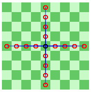

A bishop could be `([1,1]){1..}*`

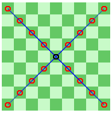

A queen could be `[0,1]{1..}*,[1,1]{1..}*`

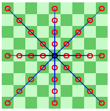

### Exponentiation

This multiplies each an **entire moveset** by itself by the number of times for
each value in the range, and then sums those multiplied movesets.

While the `{}` operator runs on each move individually, this operator, `{{}}`
actually multiplies movesets using `.` repeatedly. This may be a hard concept
to grasp - let's look at an example.

#### `([1,2],[2,1]){{2}}`

`([1,2],[2,1]){{2}} = ([1,2],[2,1]).([1,2],[2,1]) = ([1,2].[1,2]),([1,2].[2,1]),([2,1].[1,2]),([1,2].[1,2])`


=> `{{2}}` =>


#### `([1,2],[2,1])|{{2}}`


=> `|` =>

=> `{{2}}` =>


#### `([1,2],[2,1]){{2}}|`


=> `{{2}}` =>

=> `|` =>


Notice how the order of modifiers here, `|` and `{{2}}`, affect the result.
This is the case anywhere you use mirrors and then the `{{}}` operator. This is
not the case for mirorrs and `{}`, where the order does not affect the end
result.
